# 🤖 DeliveryBot — Sistema de Pedidos para Cafetería Institucional

**Automatización de pedidos vía Telegram + n8n + Google Sheets**

---

## ¿De qué se trata esto?

DeliveryBot nació como respuesta a un problema muy común en cafeterías de oficinas y universidades: las filas interminables, los pedidos mal tomados y la falta de trazabilidad. La idea fue simple — ¿qué tal si el usuario simplemente le escribe a un bot en Telegram y hace su pedido desde el celular?

El sistema usa **n8n** como motor de automatización, **Telegram** como interfaz de usuario y **Google Sheets** como base de datos. Nada de servidores costosos ni aplicaciones complicadas. Todo funciona con herramientas accesibles y gratuitas.

---

## ¿Qué puede hacer el bot?

- Mostrar el menú organizado por categorías (Bebidas, Comidas, Snacks)
- Agregar productos al carrito con la cantidad que quieras
- Calcular el total con IVA del 19% automáticamente
- Aplicar descuentos según los puntos de lealtad del usuario
- Confirmar el pedido y registrarlo en Google Sheets
- Notificar a la cocina cuando llega un pedido nuevo
- Permitir al administrador cambiar el estado del pedido desde Sheets
- Notificar al cliente cuando su pedido avanza de estado
- Mostrar el historial de pedidos del usuario
- Generar reportes diarios de ventas automáticamente cada mañana

---

## Tecnologías usadas

| Herramienta | Para qué |
|---|---|
| n8n Cloud | Motor de automatización y lógica de negocio |
| Telegram Bot API | Interfaz conversacional con el usuario |
| Google Sheets | Base de datos centralizada |
| ngrok | Túnel HTTPS para pruebas locales |
| JavaScript | Lógica dentro de los nodos Code de n8n |

---

## Estructura de la base de datos (DeliveryBot_DB)

La base de datos vive en Google Sheets y tiene 4 hojas:

[link-google-sheets](https://docs.google.com/spreadsheets/d/11v3gegOEXQlnVqUk0oTg82Gw3EHk0W3ofPpYi8ofbUk/edit?usp=sharing)

### MENU
Aquí el administrador gestiona los productos disponibles.


### PEDIDOS
Se llena automáticamente cuando alguien confirma un pedido.


### USUARIOS
Registra automáticamente a cada usuario la primera vez que usa el bot.


### SESSIONS
Guarda el estado de la conversación de cada usuario en tiempo real.


---

## Arquitectura del sistema

El sistema tiene 3 workflows en n8n:

```
DeliveryBot — Flujo Principal     →  Maneja toda la conversación y pedidos (35 nodos)
DeliveryBot — Monitor de Estados  →  Detecta cambios de estado en Sheets y notifica (4 nodos)
DeliveryBot — Reportes Diarios    →  Genera métricas de ventas cada mañana (4 nodos)
```


---

## Flujo Principal — Los 35 nodos explicados

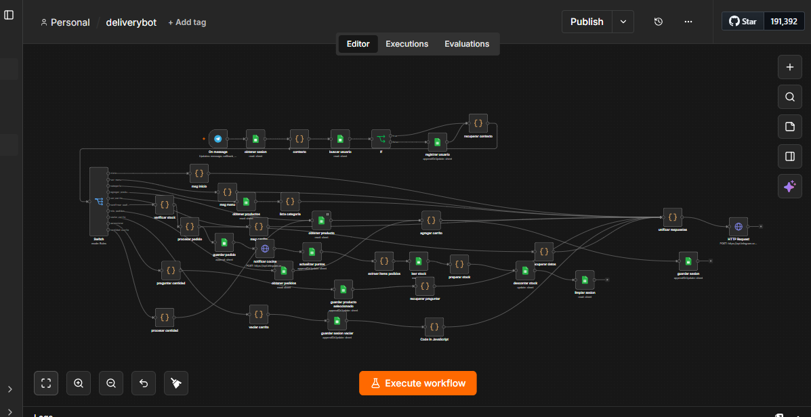

---

### NODO 1 — On message (Telegram Trigger)
El punto de entrada del sistema. Escucha todo lo que el usuario envía al bot, tanto mensajes de texto como clics en botones (callback_query).

```
Trigger On: Message + Callback Query
Credencial: Token del bot obtenido via @BotFather
```

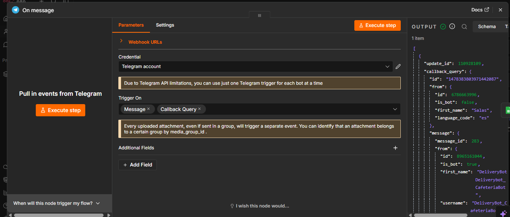

---

### NODO 2 — obtener sesion (Google Sheets)
Busca en la hoja SESSIONS si el usuario tiene una sesión activa con carrito en curso, pantalla actual y producto pendiente de cantidad.

```
Operation: Get Rows
Sheet: SESSIONS
Filter: ID_TELEGRAM = {{ $json.message?.from?.id || $json.callback_query?.from?.id }}
```
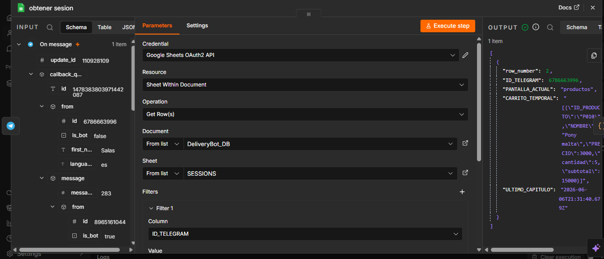
---

### NODO 3 — contexto (Code)
El nodo más importante del flujo. Toma el mensaje crudo de Telegram y la sesión del usuario y construye un objeto limpio con todo lo que los demás nodos necesitan: telegram_id, nombre, texto, pantalla actual, carrito y ULTIMO_CAPITULO.

```javascript
const telegram_id = msg.message?.from?.id?.toString() 
  || msg.callback_query?.from?.id?.toString();
const texto = msg.message?.text || msg.callback_query?.data || '';
const carrito = sesion.CARRITO_TEMPORAL ? JSON.parse(sesion.CARRITO_TEMPORAL) : [];
return [{ json: { telegram_id, nombre, texto, pantalla_actual, carrito, ULTIMO_CAPITULO } }];
```
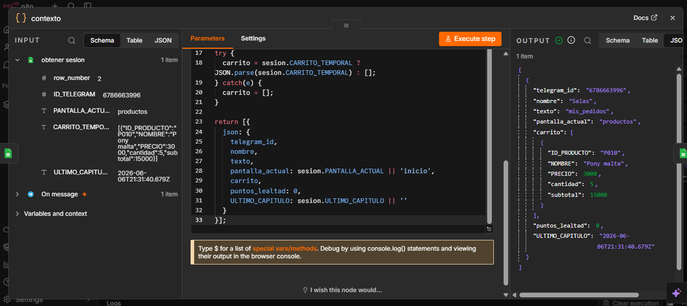
---

### NODO 4 — buscar usuario (Google Sheets)
Verifica si el usuario ya existe en la hoja USUARIOS antes de procesarlo.

```
Operation: Get Rows
Sheet: USUARIOS
Filter: ID_TELEGRAM = {{ $json.telegram_id }}
```
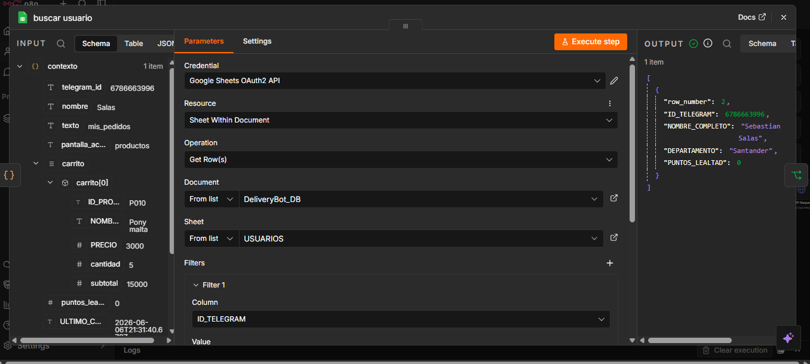
---

### NODO 5 — If
Decide si el usuario es nuevo o existente basándose en si tiene ID_TELEGRAM registrado.

```
Condition: String($json.ID_TELEGRAM) exists
True  → va directo a recuperar contexto
False → va a registrar usuario
```
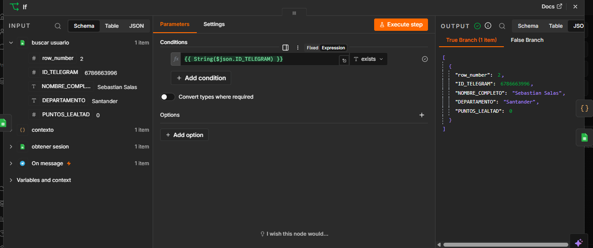
---

### NODO 6 — registrar usuario (Google Sheets)
Registra automáticamente al usuario nuevo en la hoja USUARIOS con 0 puntos de lealtad y departamento "Sin asignar".

```
Operation: Append or Update Row
Sheet: USUARIOS
Column to match: ID_TELEGRAM
Campos: ID_TELEGRAM, NOMBRE_COMPLETO, DEPARTAMENTO = Sin asignar, PUNTOS_LEALTAD = 0
```

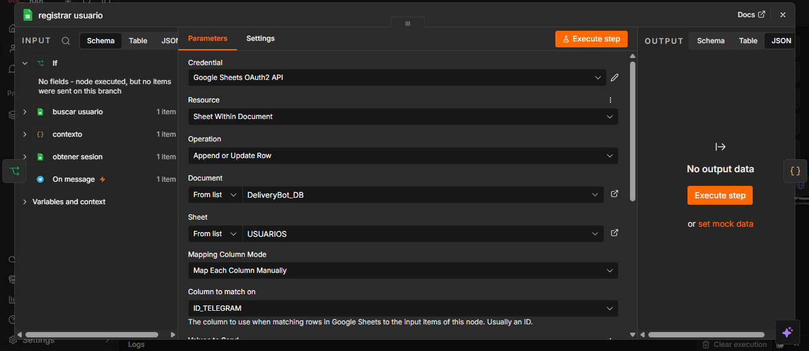

---

### NODO 7 — recuperar contexto (Code)
Une el contexto del usuario con sus puntos de lealtad actuales para que el nodo de procesar pedido pueda calcular descuentos correctamente.

```javascript
const ctx = $('contexto').first().json;
const usuario = $('buscar usuario').first().json;
return [{ json: { ...ctx, puntos_lealtad: parseInt(usuario.PUNTOS_LEALTAD) || 0 } }];
```
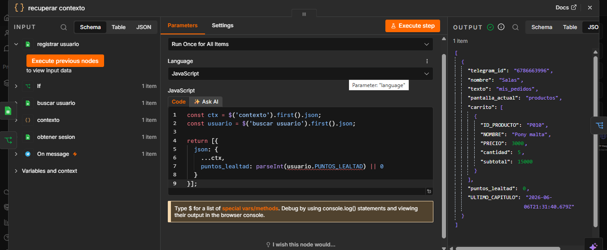
---

### NODO 8 — Switch (Router Principal)
El cerebro del bot. Dependiendo de lo que el usuario escribió o en qué botón hizo clic, decide a qué rama del flujo ir. Tiene 10 reglas configuradas.

| Regla | Condición | Valor | Destino |
|---|---|---|---|
| 1 | equals | `/start` | msg inicio |
| 2 | equals | `ver_menu` | msg menu |
| 3 | starts with | `cat_` | obtener productos |
| 4 | starts with | `sel_` | preguntar cantidad |
| 5 | starts with | `add_` | obtener producto |
| 6 | equals | `ver_carrito` | mag carrito |
| 7 | equals | `confirmar_pedido` | verificar stock |
| 8 | equals | `mis_pedidos` | obtener pedidos |
| 9 | equals | `vaciar_carrito` | vaciar carrito |
| 10 | pantalla = | `esperando_cantidad` | procesar cantidad |

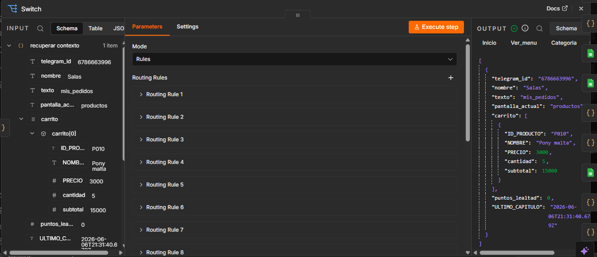

---

### NODO 9 — msg inicio (Code)
Genera el mensaje de bienvenida con los 3 botones principales cuando el usuario escribe `/start`.

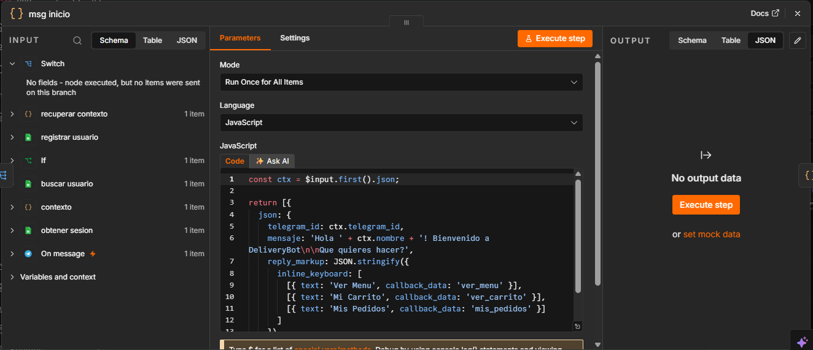
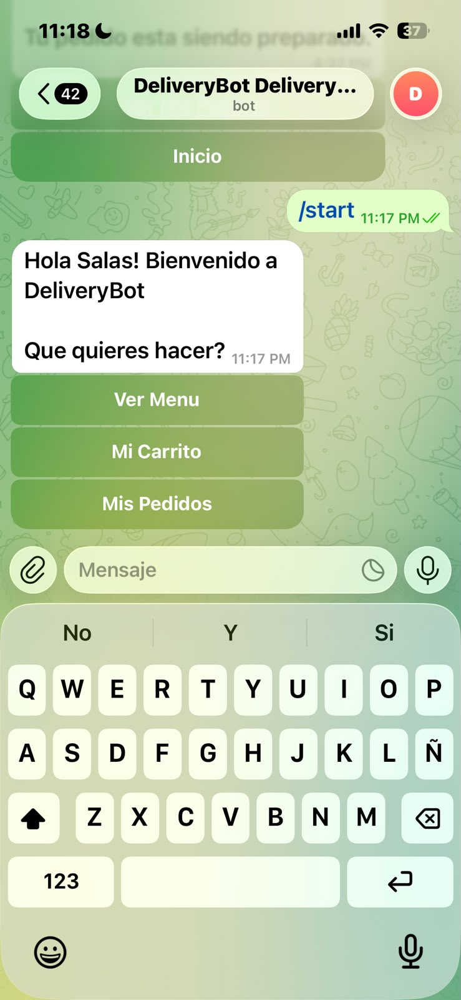
---

### NODO 10 — msg menu (Code)
Muestra las 3 categorías del menú como botones inline: Bebidas, Comidas y Snacks.

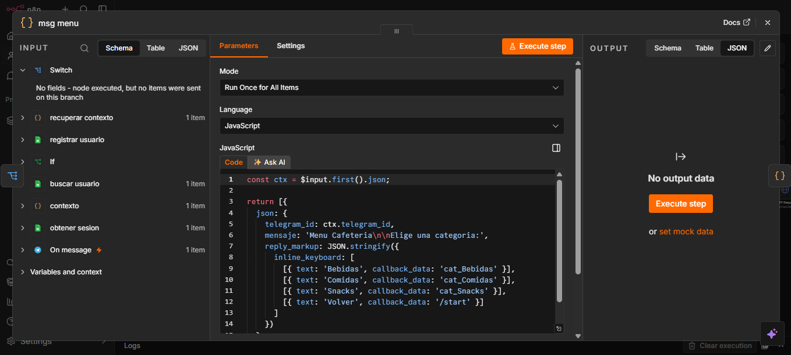

---

### NODO 11 — obtener productos (Google Sheets)
Lee todos los productos de la categoría que el usuario eligió desde la hoja MENU.

```
Operation: Get Rows
Sheet: MENU
Filter: CATEGORIA = {{ $json.texto.replace('cat_', '') }}
```
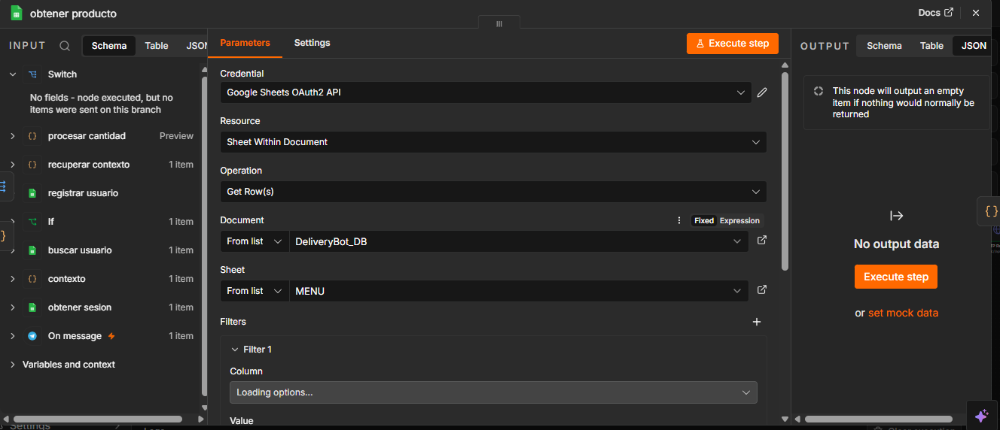
---

### NODO 12 — lista categoria (Code)
Toma los productos traídos por el nodo anterior y construye botones interactivos con el nombre, precio y stock de cada uno.

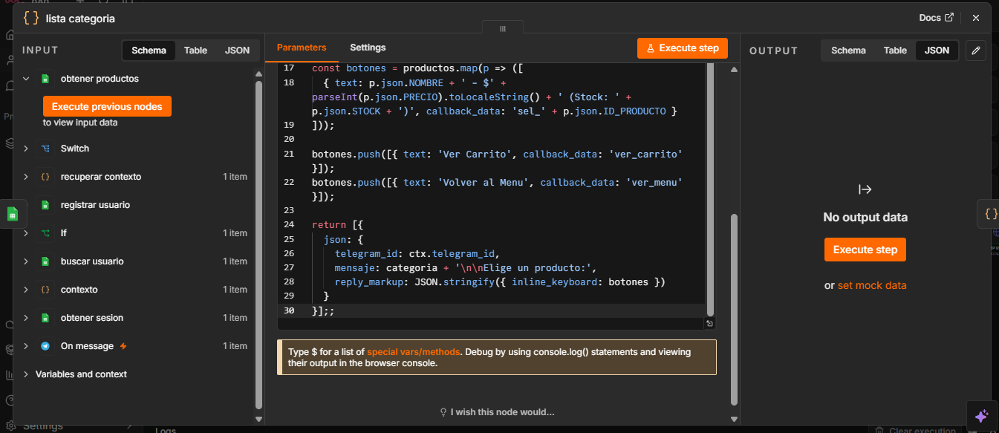

---

### NODO 13 — obtener producto (Google Sheets)
Cuando el usuario va a agregar un producto al carrito, este nodo busca los datos completos de ese producto específico en la hoja MENU.

```
Operation: Get Rows
Sheet: MENU
Filter: ID_PRODUCTO = {{ $json.texto.split('_')[1] }}
```

---

### NODO 14 — agregar carrito (Code)
Valida que haya stock disponible y agrega el producto al carrito con la cantidad seleccionada. Si el producto ya estaba en el carrito, incrementa la cantidad. Si es nuevo, lo agrega.

```javascript
if (parseInt(producto.STOCK) <= 0) {
  return [{ json: { mensaje: producto.NOMBRE + ' esta agotado.' } }];
}
const idx = carrito.findIndex(item => item.ID_PRODUCTO === producto.ID_PRODUCTO);
if (idx >= 0) {
  carrito[idx].cantidad += cantidad;
} else {
  carrito.push({ ID_PRODUCTO, NOMBRE, PRECIO, cantidad, subtotal });
}
```

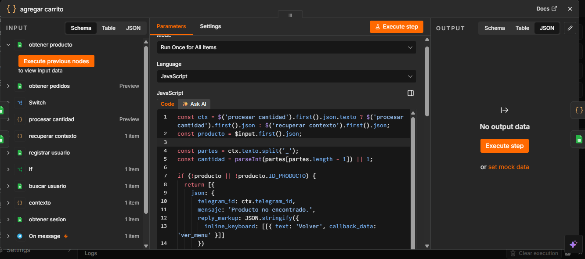

---

### NODO 15 — mag carrito (Code)
Muestra el contenido actual del carrito con el detalle de cada producto, cantidad y subtotal. Si el carrito está vacío, avisa al usuario.

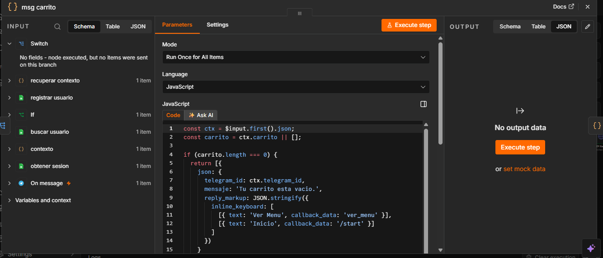
---

### NODO 16 — verificar stock (Code)
Antes de confirmar el pedido, verifica que el carrito no esté vacío. Si está vacío, le avisa al usuario. Si tiene productos, deja pasar el flujo.

```javascript
const carrito = ctx.carrito || [];
if (carrito.length === 0) {
  return [{ json: { mensaje: 'Tu carrito esta vacio.', stock_ok: false } }];
}
return [{ json: { ...ctx, stock_ok: true } }];
```
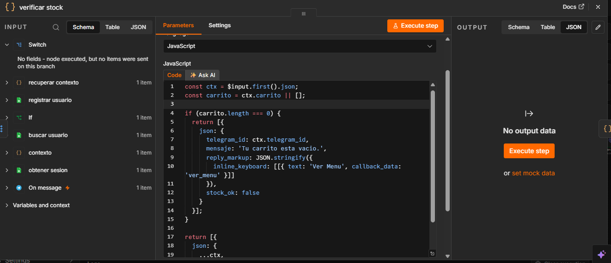

---

### NODO 16 — processar pedido (Code)
El nodo más complejo del flujo. Genera el ID único del pedido, calcula el subtotal, aplica el descuento por puntos de lealtad, calcula el IVA del 19% y suma los puntos ganados.

```javascript
const id_pedido = 'PED-' + Date.now();
const descuento = puntos >= 100 ? Math.floor(puntos / 100) * 0.10 : 0;
const descuento_valor = Math.round(subtotal * descuento);
const base = subtotal - descuento_valor;
const iva = Math.round(base * 0.19);
const total = base + iva;
const puntos_ganados = Math.floor(total / 1000);
```

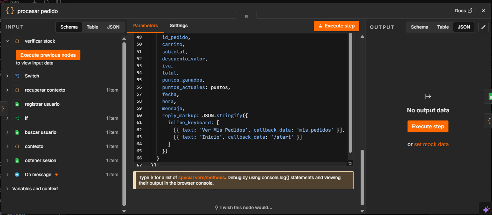

---

### NODO 17 — guardar pedido (Google Sheets)
Registra el pedido confirmado en la hoja PEDIDOS con todos sus detalles y estado inicial "Recibido".

```
Operation: Append Row
Sheet: PEDIDOS
Campos: ID_PEDIDO, ID_TELEGRAM, DETALLES_PEDIDO, TOTAL_PAGO, ESTADO = Recibido, FECHA, HORA
```
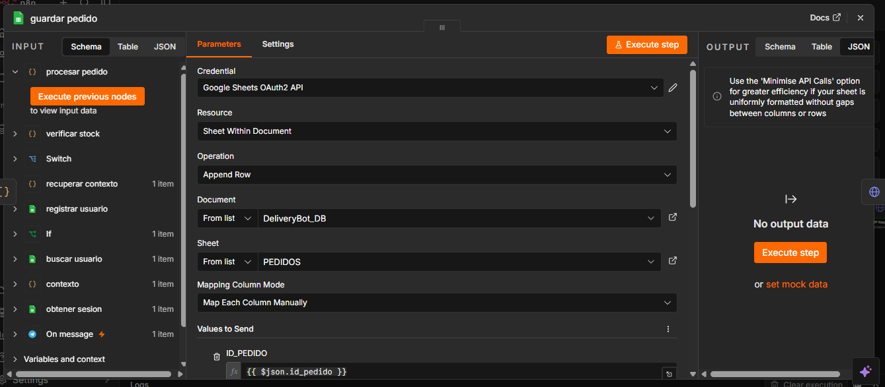

---

### NODO 17 — notificar cocina (HTTP Request)
Envía una notificación automática al personal de cocina via Telegram con el ID del pedido y el total, para que sepan que hay un nuevo pedido entrante.

```json
POST https://api.telegram.org/bot{TOKEN}/sendMessage
{
  "chat_id": "ID_COCINA",
  "text": "Nuevo pedido: PED-xxx - Total: $9.500"
}
```

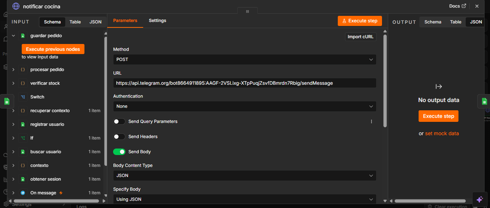
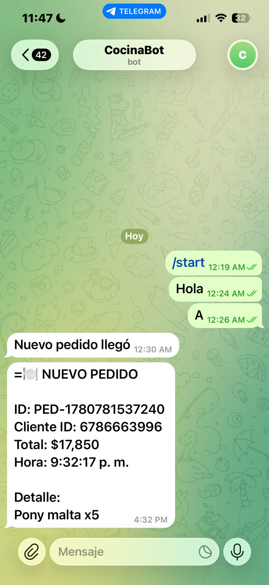

---

### NODO 18 — actualizar puntos (Google Sheets)
Suma los puntos ganados en este pedido al total acumulado del usuario en la hoja USUARIOS. Por cada $1.000 pesos se gana 1 punto.

```
Operation: Append or Update Row
Sheet: USUARIOS
PUNTOS_LEALTAD = puntos_actuales + puntos_ganados
```
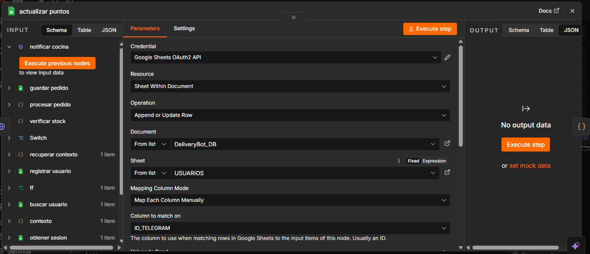

---

### NODO 19 — extraer items pedidos (Code)
Desglosa el carrito en items individuales para poder procesar el descuento de stock de cada producto por separado.

```javascript
return carrito.map(item => ({
  json: { ID_PRODUCTO: item.ID_PRODUCTO, cantidad: item.cantidad, telegram_id }
}));
```
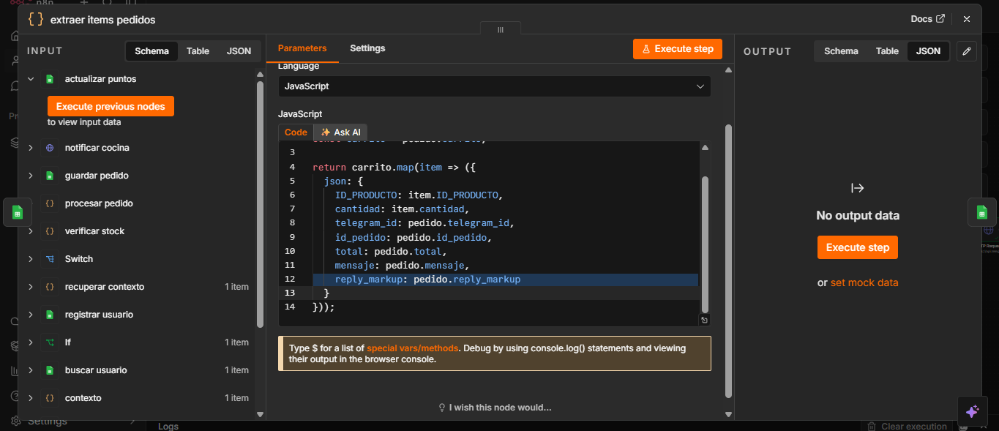
---

### NODO 20 — leer stock (Google Sheets)
Lee el stock actual de cada producto en la hoja MENU para poder calcular el nuevo valor después del descuento.

```
Operation: Get Rows
Sheet: MENU
Filter: ID_PRODUCTO = {{ $json.ID_PRODUCTO }}
Range: A:F
```
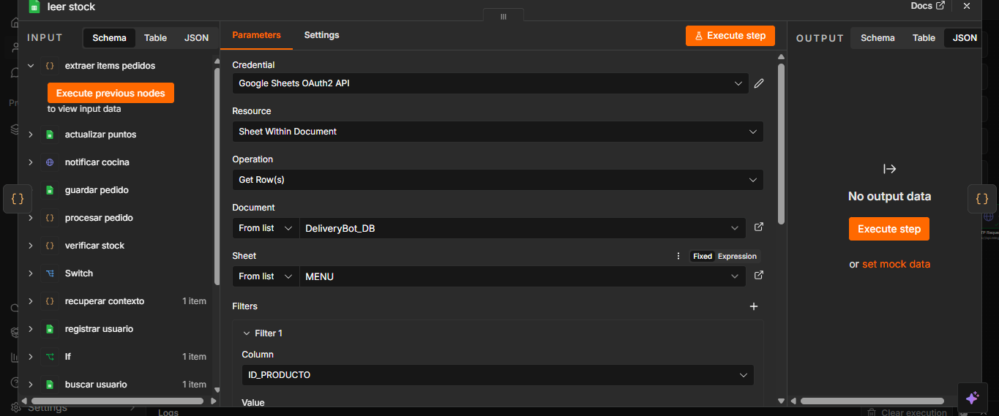
---

### NODO 21 — preparar stock (Code)
Calcula el nuevo valor de stock restando la cantidad comprada del stock actual leído en el nodo anterior.

```javascript
return items.map(item => ({
  json: {
    ID_PRODUCTO: item.json.ID_PRODUCTO,
    nuevo_stock: parseInt(item.json.STOCK) - item.json.cantidad
  }
}));
```
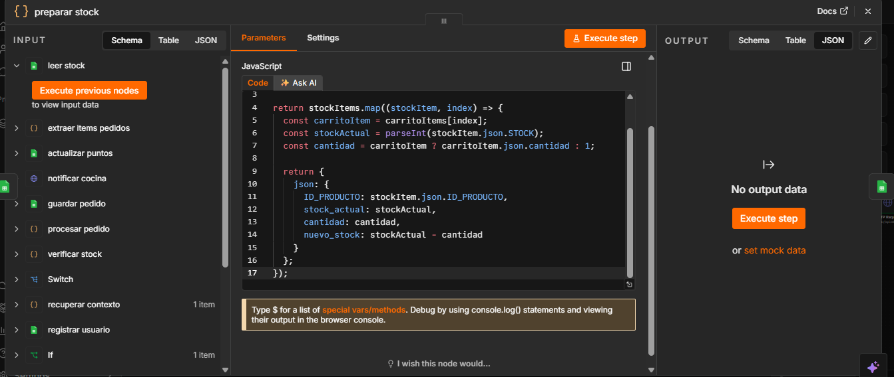

---

### NODO 21 — recuperar datos (Code)
Recupera el mensaje y los datos de respuesta desde el nodo procesar pedido para enviárselos al usuario después de limpiar la sesión.

```javascript
const anterior = $('procesar pedido').first().json;
return [{ json: { telegram_id: anterior.telegram_id, mensaje: anterior.mensaje, reply_markup: anterior.reply_markup } }];
```
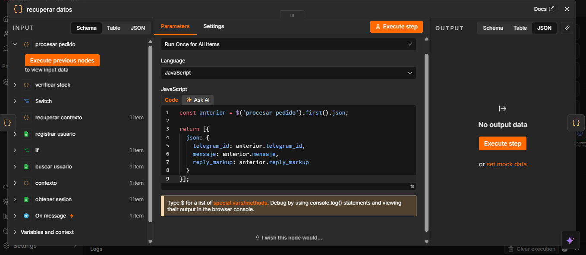

---

### NODO 22 — descontar stock (Google Sheets)
Actualiza el stock de cada producto en la hoja MENU restando la cantidad comprada.

```
Operation: Update Row
Sheet: MENU
Column to match: ID_PRODUCTO
STOCK = {{ $json.nuevo_stock }}
```

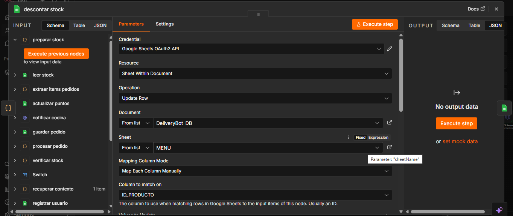

---

### NODO 23 — limpiar sesion (Google Sheets)
Vacía el carrito en SESSIONS después de que el pedido fue confirmado y registrado.

```
Operation: Append or Update Row
Sheet: SESSIONS
CARRITO_TEMPORAL = []
PANTALLA_ACTUAL = inicio
```
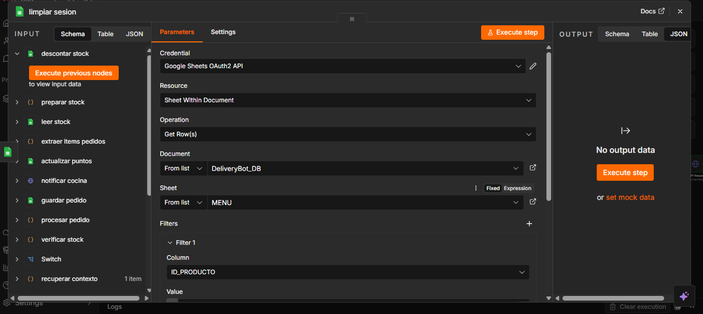

---

### NODO 24 — obtener pedidos (Google Sheets)
Lee todos los pedidos del usuario desde la hoja PEDIDOS filtrando por su ID de Telegram.

```
Operation: Get Rows
Sheet: PEDIDOS
Filter: ID_TELEGRAM = {{ $json.telegram_id }}
```
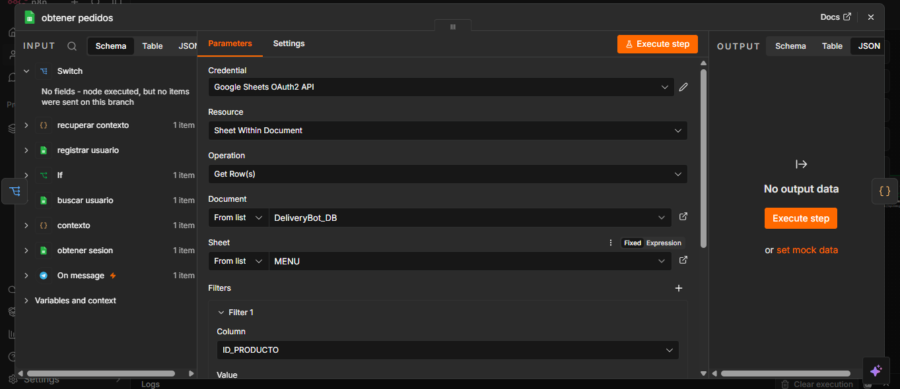

---
### NODO 25 — mag mis pedidos (Code)
Toma los pedidos traídos por obtener pedidos y muestra los últimos 7 ordenados por número de fila (los más recientes primero). Si el usuario no tiene pedidos registrados, le avisa con un mensaje amigable.
```javascript
const pedidos = $input.all();
const telegram_id = pedidos[0]?.json?.ID_TELEGRAM?.toString() || '';

// Ordena por row_number descendente para mostrar los mas recientes primero
const ordenados = pedidos.sort((a, b) => b.json.row_number - a.json.row_number);
const ultimos = ordenados.slice(0, 7);

let lista = ultimos.map(p => {
  return p.json.ID_PEDIDO + ' — ' + p.json.ESTADO + ' — $' 
    + parseInt(p.json.TOTAL_PAGO).toLocaleString() + ' — ' + p.json.FECHA;
}).join('\n');
```
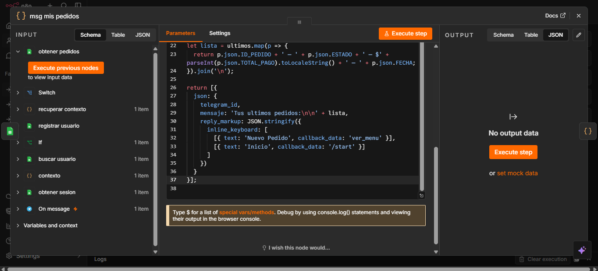

---

### NODO 26 — preguntar cantidad (Code)
Cuando el usuario selecciona un producto, el bot le pregunta cuántas unidades quiere mediante un mensaje de texto. Guarda el ID del producto en la variable id_producto.

```javascript
const id_producto = ctx.texto.replace('sel_', '');
return [{ json: { telegram_id, id_producto, mensaje: 'Cuantas unidades quieres?\n\nEscribe un numero:' } }];
```

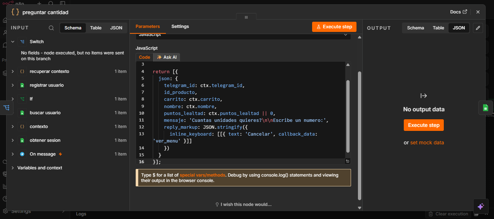

---

### NODO 27 — procesar cantidad (Code)
Recibe el número escrito por el usuario, recupera el ID del producto guardado en SESSIONS (ULTIMO_CAPITULO) y construye el callback `add_PRODUCTO_CANTIDAD` para que el Switch lo enrute correctamente.

```javascript
const cantidad = parseInt(ctx.texto);
const id_producto = ctx.ULTIMO_CAPITULO || '';
return [{ json: { ...ctx, texto: 'add_' + id_producto + '_' + cantidad } }];
```
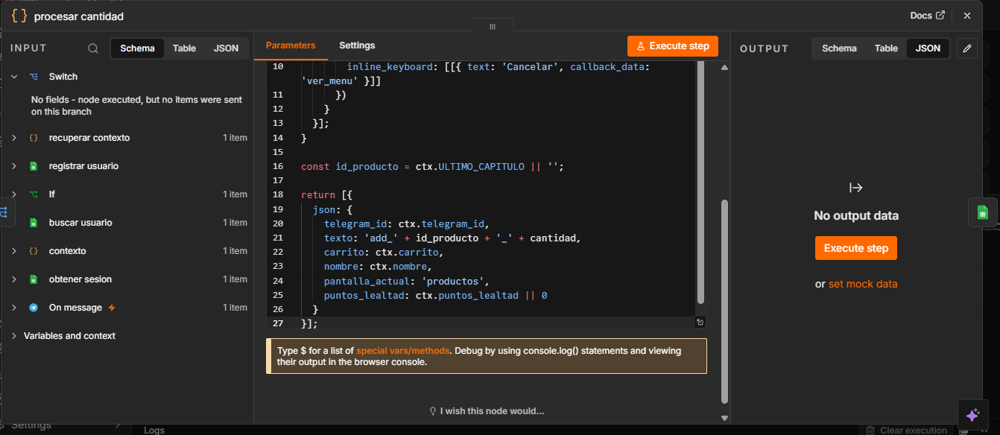

---

### NODO 28 — vaciar carrito (Code)
Permite al usuario limpiar su carrito manualmente antes de confirmar el pedido.

```javascript
return [{ json: { telegram_id, carrito_actualizado: [], mensaje: 'Carrito vaciado correctamente.' } }];
```
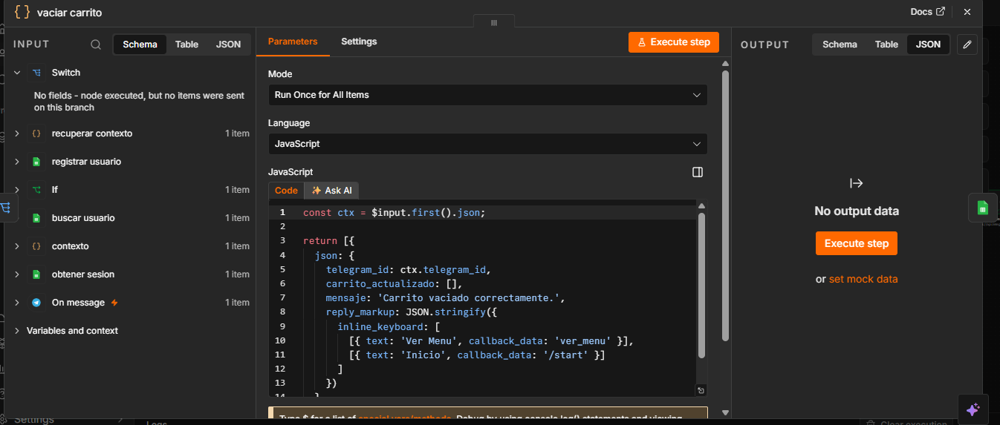

---

### NODO 29 — guardar producto seleccionado (Google Sheets)
Cuando el bot pregunta la cantidad, guarda el ID del producto en la columna ULTIMO_CAPITULO de SESSIONS para no perderlo entre mensajes.
```
Operation: Append or Update Row
Sheet: SESSIONS
ULTIMO_CAPITULO = {{ $json.id_producto }}
PANTALLA_ACTUAL = esperando_cantidad
```
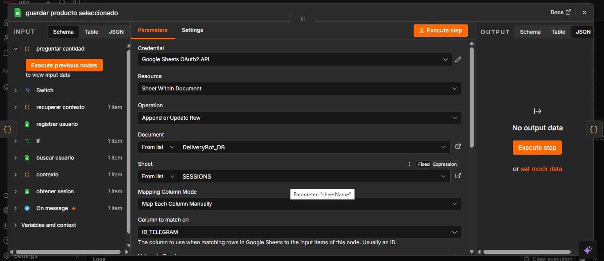

---

### NODO 30 — guardar sesion vaciar (Google Sheets)
Persiste el carrito vacío en SESSIONS cuando el usuario elige vaciar el carrito manualmente.

```
Operation: Append or Update Row
Sheet: SESSIONS
CARRITO_TEMPORAL = []
PANTALLA_ACTUAL = inicio
```
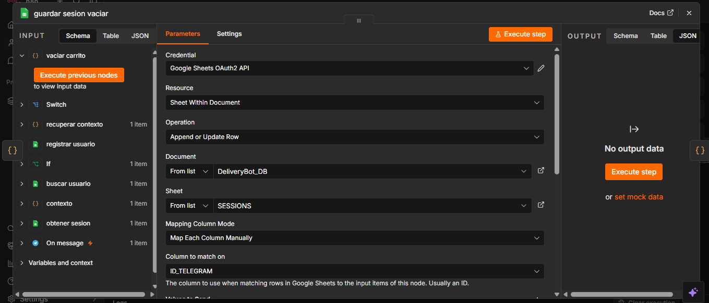

---

### NODO 31 — Code in JavaScript (recuperar datos vaciar)
Recupera el mensaje de confirmación desde el nodo vaciar carrito para enviárselo al usuario después de guardar la sesión.

```javascript
const anterior = $('vaciar carrito').first().json;
return [{ json: { telegram_id: anterior.telegram_id, mensaje: anterior.mensaje, reply_markup: anterior.reply_markup } }];
```
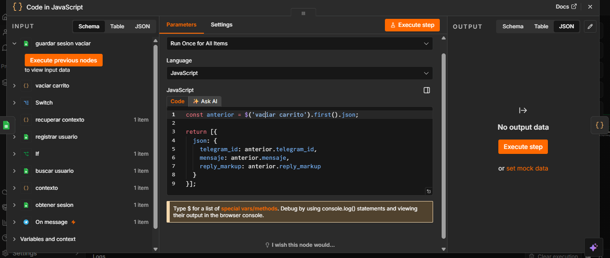

---

### NODO 32 — recuperar preguntar (Code)
Recupera el mensaje de preguntar cantidad para enviárselo al usuario después de guardar el producto seleccionado en SESSIONS.

```javascript
const anterior = $('preguntar cantidad').first().json;
return [{ json: { telegram_id: anterior.telegram_id, mensaje: anterior.mensaje, reply_markup: anterior.reply_markup } }];
```
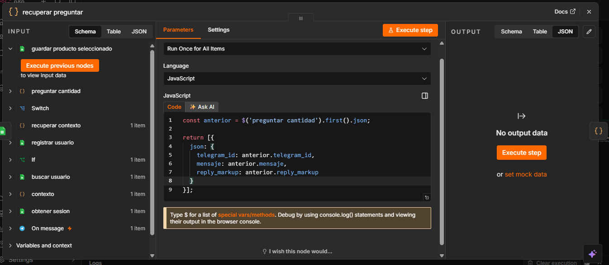

---

### NODO 33 — guardar sesion (Google Sheets)
Persiste el carrito actualizado en SESSIONS cada vez que el usuario agrega un producto.

```
Operation: Append or Update Row
Sheet: SESSIONS
CARRITO_TEMPORAL = {{ JSON.stringify($json.carrito_actualizado) }}
```
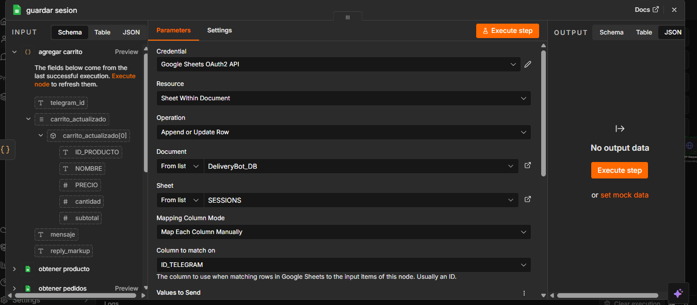

---

### NODO 34 — unificar respuestas (Code)
Punto de convergencia de todos los flujos. Garantiza que el mensaje, el telegram_id y el reply_markup lleguen correctamente al nodo de envío sin importar por qué rama del flujo se llegó.

```javascript
const items = $input.all();
for (const item of items) {
  if (item.json.telegram_id && item.json.mensaje) {
    return [{ json: item.json }];
  }
}
```
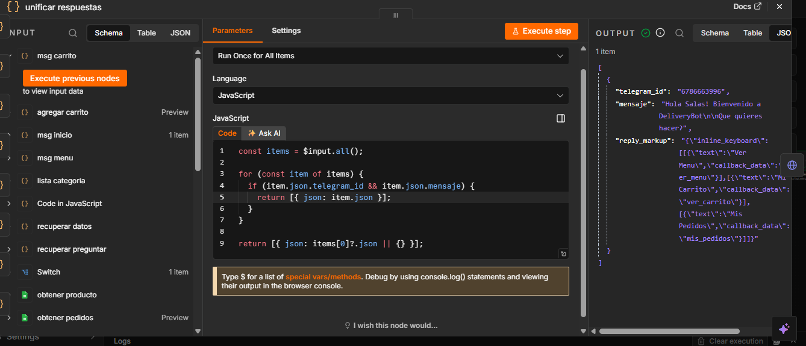

---

### NODO 35 — HTTP Request (Enviar mensaje)
Envía el mensaje final al usuario via la API oficial de Telegram. Se usa HTTP Request en lugar del nodo nativo de Telegram porque permite enviar el reply_markup como JSON completo.

```json
POST https://api.telegram.org/bot{TOKEN}/sendMessage
{
  "chat_id": "{{ $json.telegram_id }}",
  "text": "{{ $json.mensaje }}",
  "reply_markup": "{{ $json.reply_markup }}"
}
```

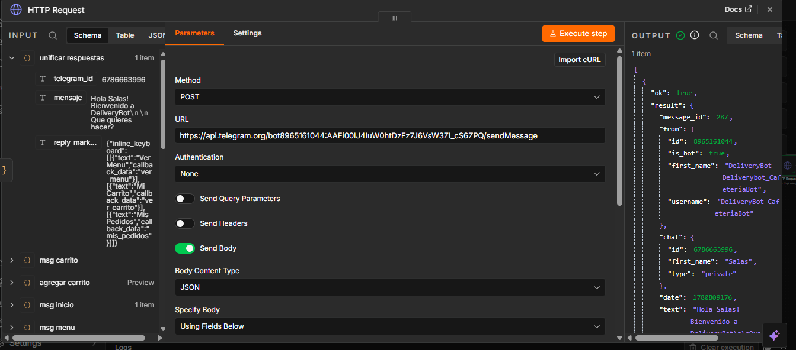

---

## Monitor de Estados — Los 4 nodos explicados

Este workflow corre de forma independiente cada minuto. Cuando el administrador cambia el estado de un pedido en la hoja PEDIDOS, el bot le notifica automáticamente al cliente.

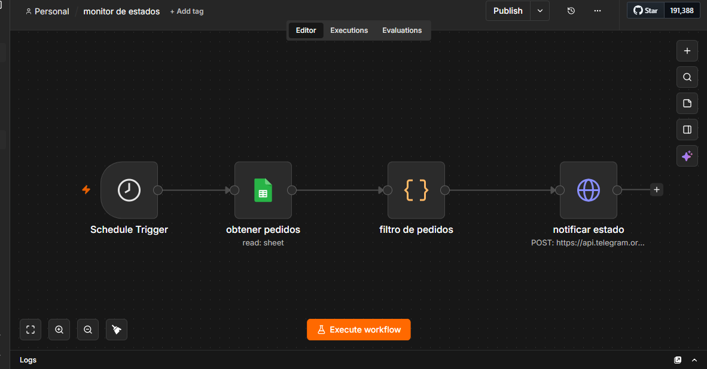

### NODO 1 — Schedule Trigger
Se activa automáticamente cada 1 minuto sin necesidad de intervención.

```
Trigger Interval: Minutes
Minutes Between Triggers: 1
```
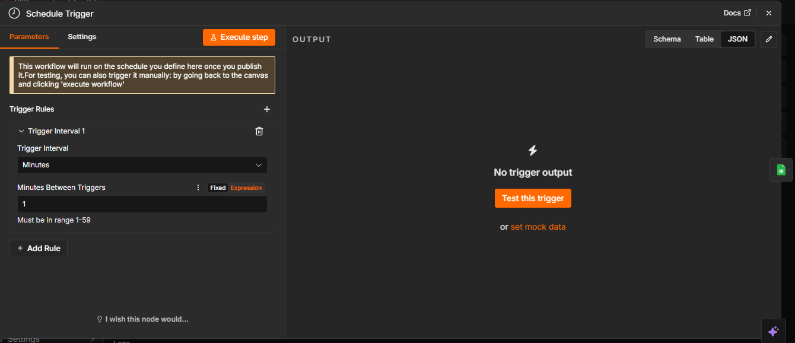

```

### NODO 2 — obtener todos los pedidos (Google Sheets)
Lee todos los pedidos de la hoja PEDIDOS sin filtros para revisarlos todos.

```
Operation: Get Rows
Sheet: PEDIDOS
```

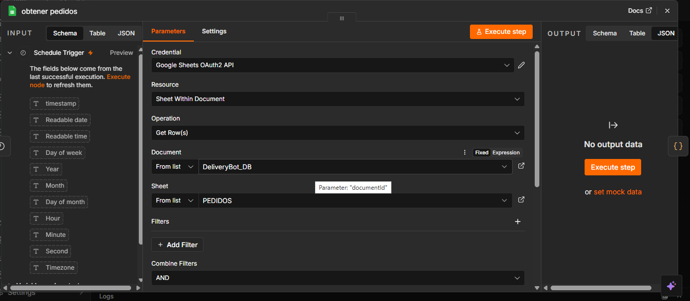

```

### NODO 3 — filtro de pedidos (Code)
Filtra solo los pedidos que están en estados intermedios — ni Recibido ni Entregado. Estos son los que necesitan notificación al cliente.

```javascript
const activos = pedidos.filter(p => 
  p.json.ESTADO !== 'Entregado' && p.json.ESTADO !== 'Recibido'
);
```


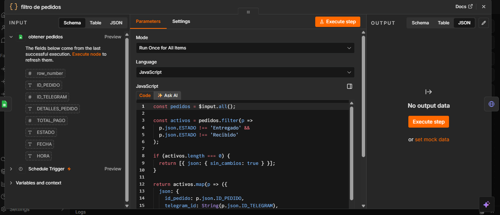


### NODO 4 — notificar estado (HTTP Request)
Envía un mensaje al cliente informando el nuevo estado de su pedido.

```json
{
  "chat_id": {{ $json.telegram_id }},
  "text": "Tu pedido PED-xxx esta ahora en estado: Preparacion"
}
```
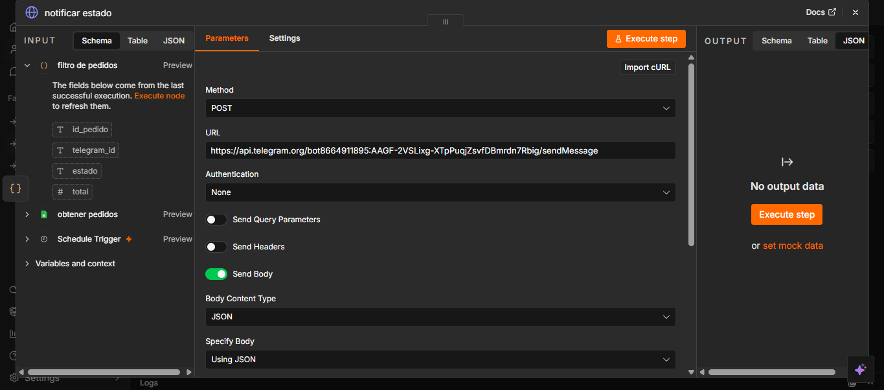

```

Para cambiar el estado, el administrador edita directamente la columna ESTADO en Google Sheets:

```
Recibido → Preparacion → En camino → Entregado


---

## Reportes Diarios — Los 4 nodos explicados

Este workflow genera automáticamente un reporte de ventas cada día a las 8am y lo envía al administrador por Telegram.

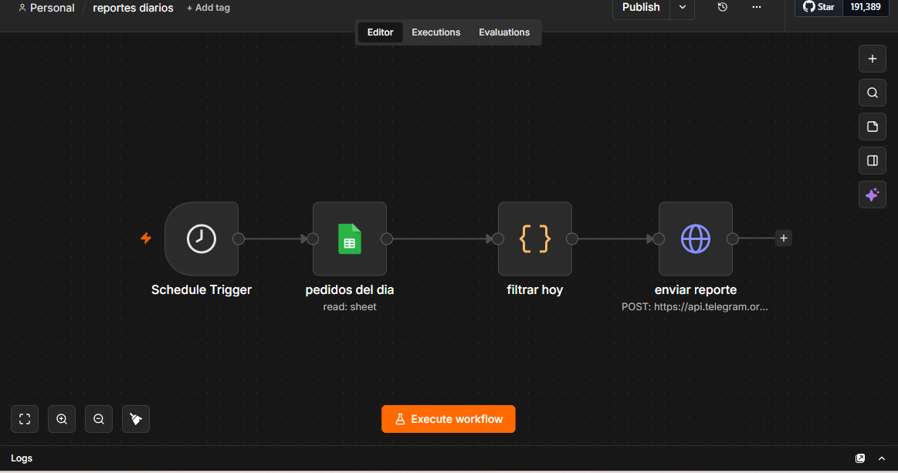

## NODO 1 — Schedule Trigger
Se activa todos los días a las 8am automáticamente.

```
Trigger Interval: Days
Days Between Triggers: 1
Trigger at Hour: 8
---
```
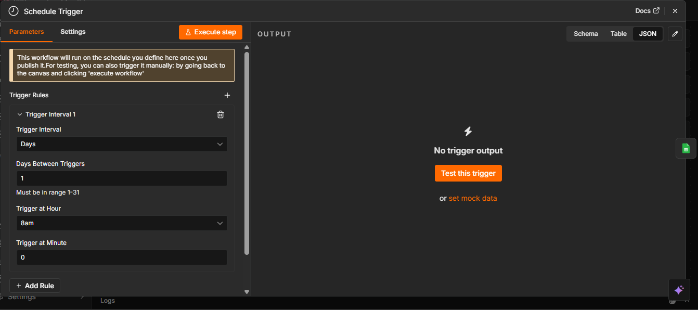

---


### NODO 2 — pedidos del dia (Google Sheets)
Lee todos los pedidos de la hoja PEDIDOS para filtrarlos por fecha.

```
Operation: Get Rows
Sheet: PEDIDOS

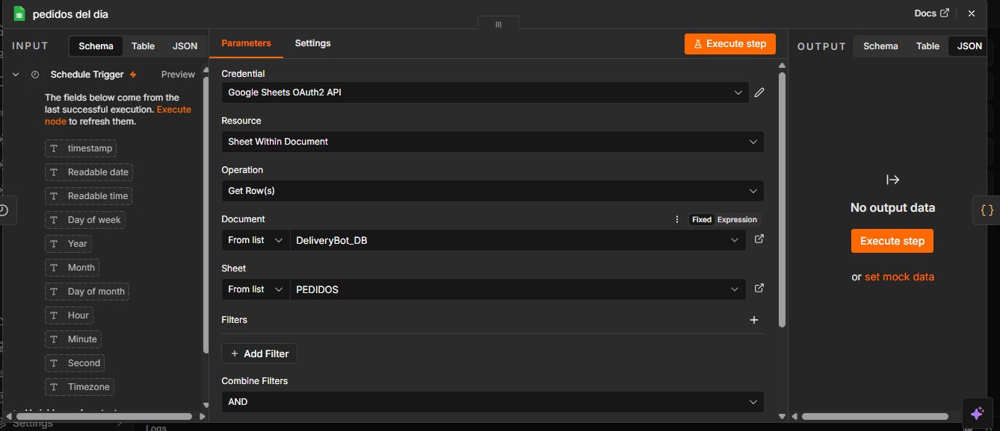

```

### NODO 3 — filtrar hoy (Code)
Filtra solo los pedidos del día actual, calcula el total de ventas y genera el ranking de productos más vendidos.

```javascript
const hoy = new Date().toLocaleDateString('es-CO');
const pedidosHoy = pedidos.filter(p => p.json.FECHA === hoy);
const total = pedidosHoy.reduce((sum, p) => sum + parseInt(p.json.TOTAL_PAGO), 0);
// Construye ranking de productos mas vendidos
const masVendidos = Object.entries(conteo).sort((a, b) => b[1] - a[1]).slice(0, 3);
```


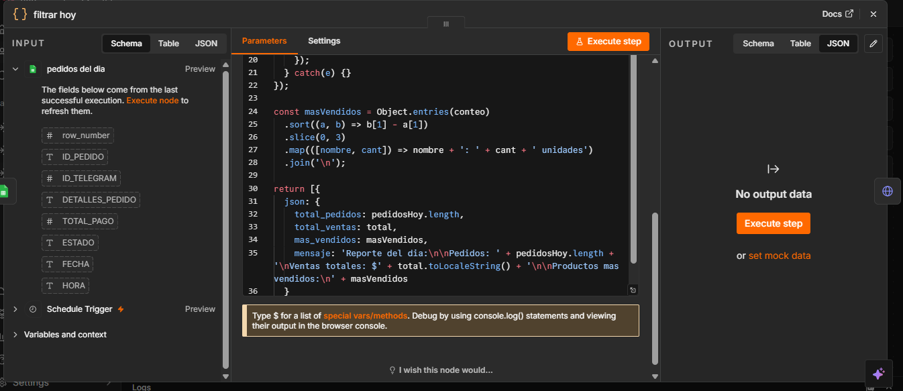


### NODO 4 — enviar reporte (HTTP Request)
Envía el reporte al administrador via Telegram con el resumen del día.

```
Reporte del dia:
Pedidos: 12
Ventas totales: $185.000

Productos mas vendidos:
Cafe Americano: 8 unidades
Empanada de Pollo: 6 unidades
Jugo de Naranja: 4 unidades
```

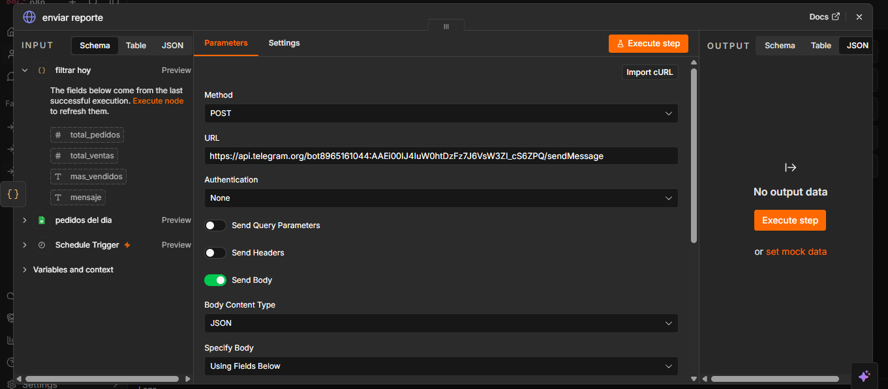
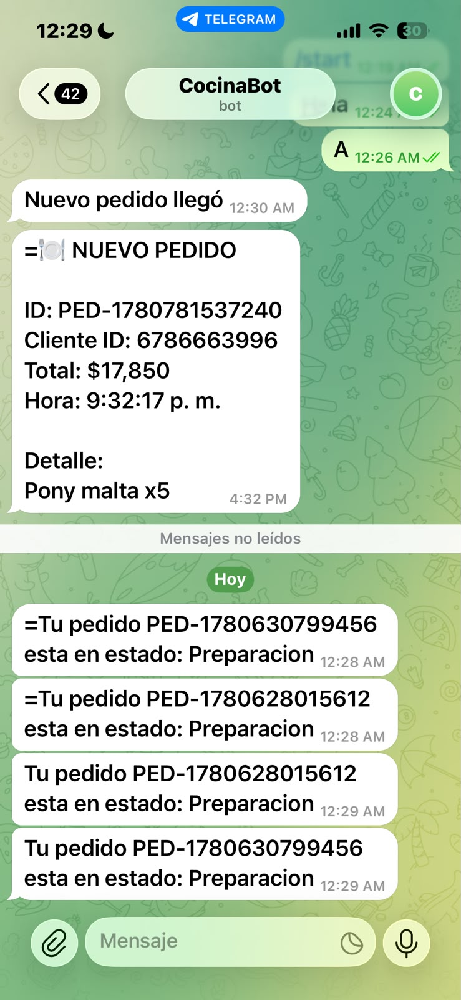

---

## Sistema de Puntos e IVA

### Cálculo del total

```
Subtotal      = suma de todos los productos del carrito
Descuento     = subtotal × (floor(puntos / 100) × 10%)  →  solo si puntos >= 100
Base gravable = subtotal - descuento
IVA (19%)     = base gravable × 0.19
Total a pagar = base gravable + IVA
Puntos ganados = floor(total / 1000)
```

### Ejemplo práctico

```
Productos:       Café x2 ($7.000) + Empanada x1 ($2.500) = $9.500
Puntos usuario:  200 puntos → descuento 20%
Descuento:       -$1.900
Base gravable:   $7.600
IVA 19%:         $1.444
Total a pagar:   $9.044
Puntos ganados:  9 puntos
```

---

## Errores que encontramos y cómo los resolvimos

Durante el desarrollo el proyecto tuvo bastantes tropiezos. Aquí están los más importantes:

---

### ❌ Error 1 — "Bad webhook: HTTPS URL must be provided"

**Qué pasó:** Telegram no acepta webhooks en localhost. Solo acepta URLs con HTTPS público, y n8n local no tiene eso por defecto.

**Cómo lo resolvimos:** Primero usamos ngrok para exponer el servidor local con una URL pública. Después migramos a n8n Cloud que ya incluye HTTPS sin ninguna configuración adicional.

```bash
ngrok http 5678
# Resultado: https://justifier-clone-skillful.ngrok-free.dev -> localhost:5678
```

> 📸 **[PANTALLAZO: Terminal con ngrok corriendo y URL pública]**

---

### ❌ Error 2 — La variable N8N_WEBHOOK_URL no funcionaba en Windows

**Qué pasó:** Por más que configurábamos la variable de entorno en Windows con `set` o `setx`, n8n seguía mostrando localhost en el Webhook URL del nodo.

**Cómo lo resolvimos:** Registramos el webhook directamente en Telegram usando su API via curl, apuntando manualmente a la URL de ngrok.

```bash
curl -X POST "https://api.telegram.org/bot{TOKEN}/setWebhook" \
  -H "Content-Type: application/json" \
  -d "{\"url\":\"https://justifier-clone-skillful.ngrok-free.dev/webhook/deliverybot\"}"
# Respuesta: {"ok":true,"result":true,"description":"Webhook was set"}
```

---

### ❌ Error 3 — Google Sheets con ID vacío al importar el workflow

**Qué pasó:** Al importar el JSON del workflow, los nodos de Google Sheets quedaban sin el ID del documento configurado y lanzaban el error "Cannot get sheet By ID with a value of empty".

**Cómo lo resolvimos:** Reconfiguramos manualmente cada nodo de Google Sheets seleccionando el documento DeliveryBot_DB desde la lista desplegable y verificando que todas las hojas estuvieran correctamente referenciadas.

> 📸 **[PANTALLAZO: Configuración correcta de un nodo Google Sheets con documento seleccionado]**

---

### ❌ Error 4 — "Cannot read properties of undefined (telegram_id)"

**Qué pasó:** El filtro del nodo obtener sesion usaba `$json.message.from.id` que no existe cuando el mensaje es un clic en un botón (callback_query). Los dos tipos de mensaje tienen estructuras diferentes.

**Cómo lo resolvimos:** Usamos el operador OR con optional chaining para manejar ambos casos en el mismo filtro:

```javascript
={{ $json.message?.from?.id || $json.callback_query?.from?.id }}
```

---

### ❌ Error 5 — Los botones del menú no hacían nada

**Qué pasó:** Al hacer clic en los botones inline, el bot no respondía. El Telegram Trigger solo estaba configurado para escuchar mensajes de texto, no callback_query.

**Cómo lo resolvimos:** Agregamos "Callback Query" en el campo Trigger On del nodo Telegram Trigger.

> 📸 **[PANTALLAZO: Trigger On con Message y Callback Query activados]**

---

### ❌ Error 6 — El reply_markup no mostraba botones en Telegram

**Qué pasó:** El nodo nativo de Telegram en n8n no aceptaba el JSON del inline_keyboard como un string. Los botones nunca aparecían en los mensajes.

**Cómo lo resolvimos:** Reemplazamos el nodo Telegram por un nodo HTTP Request que llama directamente a la API de Telegram, lo que nos da control total sobre el body del request y permite enviar el reply_markup correctamente.

> 📸 **[PANTALLAZO: Configuración del nodo HTTP Request para enviar mensajes con botones]**

---

### ❌ Error 7 — El carrito no acumulaba productos

**Qué pasó:** Al agregar un segundo producto, el carrito solo mostraba el último porque el nodo guardar sesion no retornaba el mensaje ni el telegram_id al siguiente nodo, perdiendo el contexto.

**Cómo lo resolvimos:** Conectamos agregar al carrito con dos salidas: una directa a unificar respuestas para el mensaje, y otra a guardar sesion para persistir el carrito. De esta manera los datos del mensaje no pasan por Google Sheets y no se pierden.

---

### ❌ Error 8 — El ID del producto se perdía al escribir la cantidad

**Qué pasó:** Al implementar la selección de cantidad por texto, el ID del producto se perdía entre mensajes. El resultado era `add__3` (con ID vacío) y el sistema respondía "Producto no encontrado".

**Cómo lo resolvimos:** Guardamos el ID del producto en la columna ULTIMO_CAPITULO de SESSIONS cuando el bot pregunta la cantidad, y lo recuperamos desde ahí cuando el usuario escribe el número.

```javascript
// Al preguntar cantidad → guardar en SESSIONS:
ULTIMO_CAPITULO = id_producto
PANTALLA_ACTUAL = esperando_cantidad

// Al procesar la cantidad escrita:
const id_producto = ctx.ULTIMO_CAPITULO || '';
texto = 'add_' + id_producto + '_' + cantidad;
```

---

### ❌ Error 9 — El stock siempre quedaba en el mismo valor

**Qué pasó:** El nodo descontar stock siempre dejaba el stock igual porque tomaba el valor del primer producto del carrito para todos los demás, ignorando el stock real de cada uno.

**Cómo lo resolvimos:** Agregamos el nodo leer stock antes de descontar stock para obtener el valor actual de cada producto individualmente, y luego calculamos el nuevo stock correctamente.

```javascript
nuevo_stock = parseInt(stockActual.STOCK) - item.cantidad
```

> 📸 **[PANTALLAZO: Hoja MENU con stock correcto después del descuento]**

---

### ❌ Error 10 — Espacio invisible en encabezado de Google Sheets

**Qué pasó:** La columna ID_TELEGRAM de la hoja PEDIDOS tenía un espacio en blanco al inicio (" ID_TELEGRAM"), lo que hacía que n8n leyera el campo como undefined y el monitor de estados no podía notificar a nadie.

**Cómo lo resolvimos:** Editamos directamente el encabezado en Google Sheets eliminando el espacio invisible.

---
## Autor
**Juan Sebastián Salas**