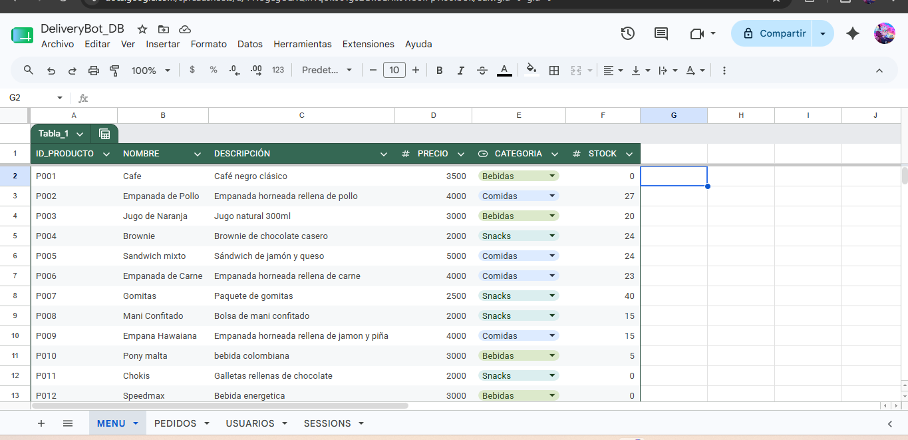
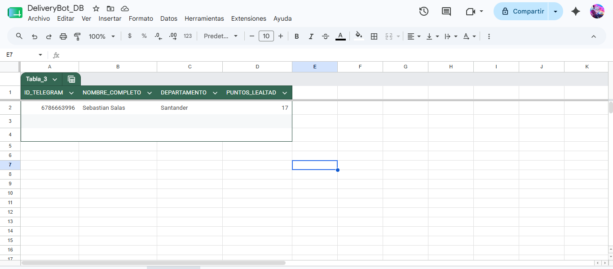
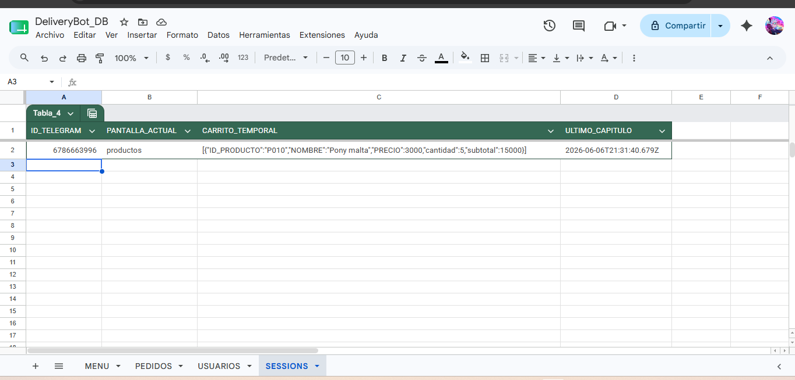

# 🤖 DeliveryBot — Sistema de Pedidos para Cafetería Institucional

**Automatización de pedidos vía Telegram + n8n + Google Sheets**

---

## ¿De qué se trata esto?

DeliveryBot nació como respuesta a un problema muy común en cafeterías de oficinas y universidades: las filas interminables, los pedidos mal tomados y la falta de trazabilidad. La idea fue simple — ¿qué tal si el usuario simplemente le escribe a un bot en Telegram y hace su pedido desde el celular?

El sistema usa **n8n** como motor de automatización, **Telegram** como interfaz de usuario y **Google Sheets** como base de datos. Nada de servidores costosos ni aplicaciones complicadas. Todo funciona con herramientas accesibles y gratuitas.

---

## ¿Qué puede hacer el bot?

- Mostrar el menú organizado por categorías (Bebidas, Comidas, Snacks)
- Agregar productos al carrito con la cantidad que quieras
- Calcular el total con IVA del 19% automáticamente
- Aplicar descuentos según los puntos de lealtad del usuario
- Confirmar el pedido y registrarlo en Google Sheets
- Notificar a la cocina cuando llega un pedido nuevo
- Permitir al administrador cambiar el estado del pedido desde Sheets
- Notificar al cliente cuando su pedido avanza de estado
- Mostrar el historial de pedidos del usuario
- Generar reportes diarios de ventas automáticamente cada mañana

---

## Tecnologías usadas

| Herramienta | Para qué |
|---|---|
| n8n Cloud | Motor de automatización y lógica de negocio |
| Telegram Bot API | Interfaz conversacional con el usuario |
| Google Sheets | Base de datos centralizada |
| ngrok | Túnel HTTPS para pruebas locales |
| JavaScript | Lógica dentro de los nodos Code de n8n |

---

## Estructura de la base de datos (DeliveryBot_DB)

La base de datos vive en Google Sheets y tiene 4 hojas:

### MENU
Aquí el administrador gestiona los productos disponibles.

### PEDIDOS
Se llena automáticamente cuando alguien confirma un pedido.

### USUARIOS
Registra automáticamente a cada usuario la primera vez que usa el bot.

### SESSIONS
Guarda el estado de la conversación de cada usuario en tiempo real.

---
